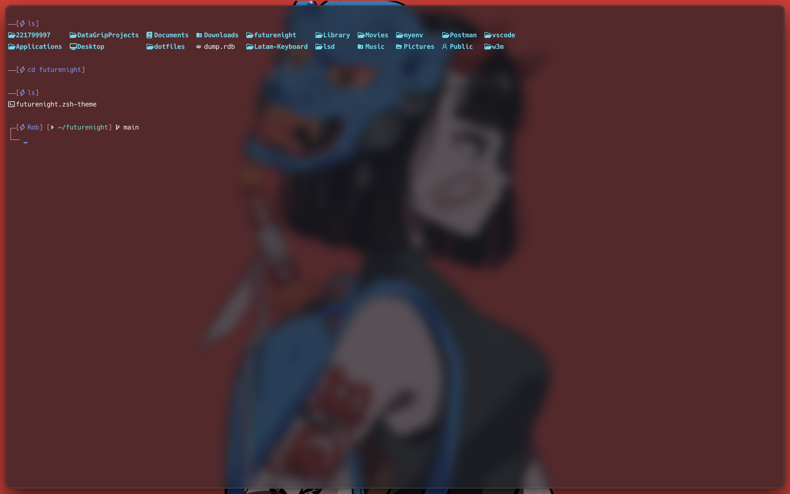
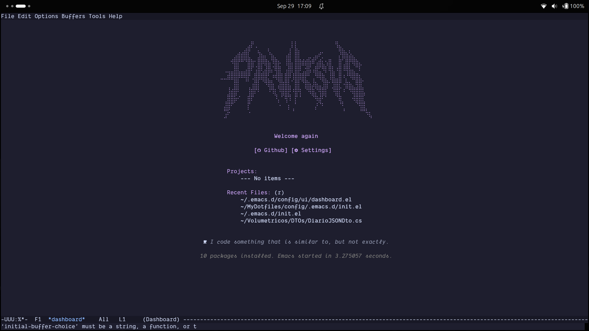

# prvrsvs dotfiles

<div align="center">
    <h1>✨ My dotfiles</h1>
    <p style="text-align:center;">
      This repository contains my personal terminal, pugins and emacs setup, including configurations for various packages and terminal utilities. It's designed to streamline my development environment and can serve as a base for others looking to customize their Emacs experience.
    </p>
    
    
</div>

## 🚀 Quick Start

Clone the repository and open Emacs:

```bash
git clone https://github.com/prvrsvs/MyDotfiles.git
```

All custom settings will be loaded automatically.

## 🛠️ Requirements
Kitty
Emacs 30+
Git
zsh
Dank Mono fonts

## 💡 Notes

Tailored for my personal workflow; feel free to adjust.
Fork, clone, and explore freely.
Contributions and improvements are welcome via pull requests.

## 🧰 Tools & Packages

<details>
<summary>Click to reveal</summary>

### Emacs

* **Corfu** → *Auto-completion*
* **eglot** → *lsp-server managament*
* **magit** → *Git service*

### Terminal tools

* **zsh** → *Personal shortcuts*
* **Package Management** → *Installed packages handling*
* **General Settings** → *Emacs general configurations*


### UI / Look & Feel

* **Dashboard** → *Startup dashboard*
* **Faces / Fonts / Styles** → *Styling*
* **UI tweaks** → *Interface adjustments*
* **Modeline customization** → *Modeline tweaks*
* **Themes / Colors** → *Theme setup*
* **Banners** → *bocchi-smiling* → *emu* → *frieren* → *laptop-anime-girl* → *uwu*

### Misc / Optimization

* **Misc utilities** → *General utilities*
* **Performance tweaks** → *Optimizations*
* **Aliases** → *Command shortcuts*

</details>